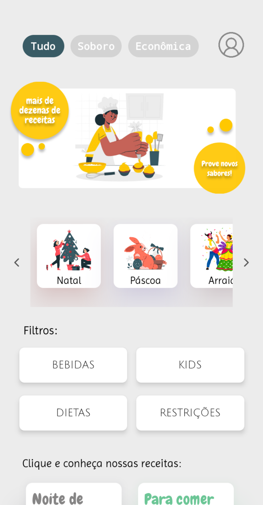
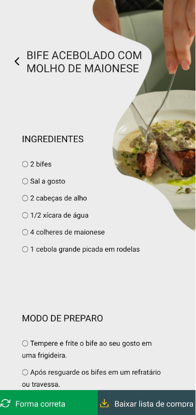
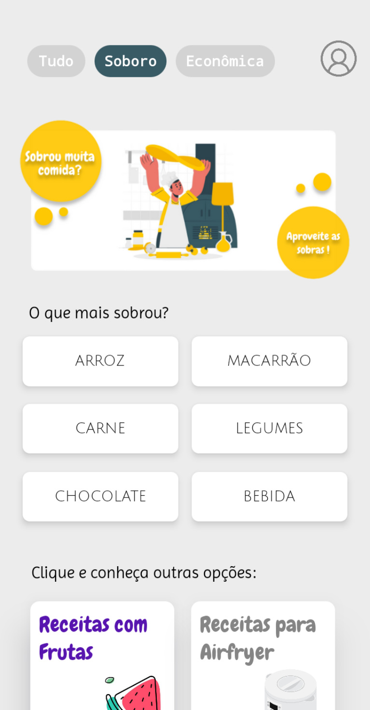
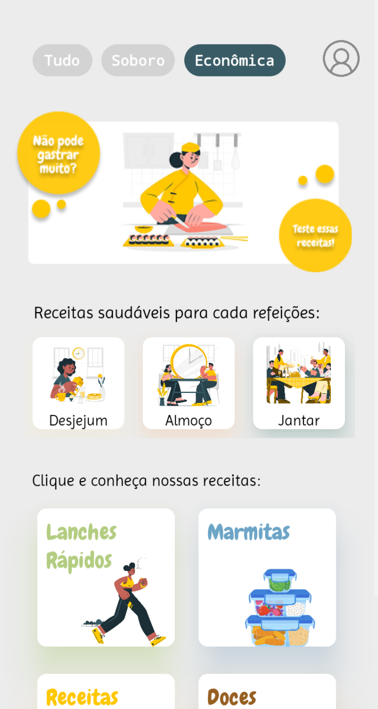
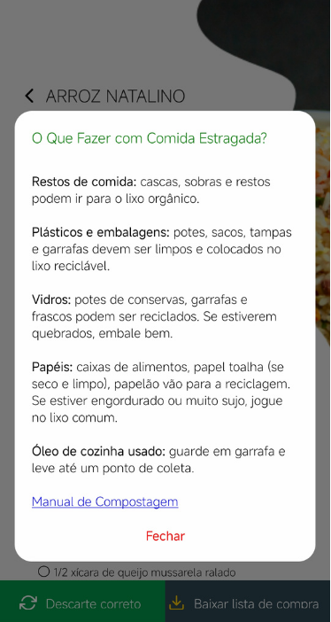

# Sabor Na Mão

> Aplicativo mobile em React Native que ajuda você a encontrar a receita perfeita para cada data comemorativa. Descubra pratos ideais para cada ocasião ou publique suas próprias receitas, salvas com privacidade só para você.


---

## Sobre o projeto

O Sabor na Mão nasceu para resolver um problema simples: encontrar a receita certa para a ocasião certa. Em vez de garimpar dezenas de sites e perfis de culinária, o app organiza sugestões de pratos a partir de **datas comemorativas** (Natal, Páscoa, festas juninas, e muito mais), tornando o planejamento das suas refeições especiais mais fácil e rápido.

Além de buscar receitas prontas, cada usuário pode **criar e salvar suas próprias receitas**, mantidas privadas e acessíveis somente por quem as criou.

---

## Funcionalidades

- **Busca por data comemorativa** — encontre receitas alinhadas ao evento que você está celebrando
- **Catálogo de receitas** — ingredientes e modo de preparo organizados de forma clara
- **Receitas próprias** — publique e gerencie suas próprias criações culinárias
- **Privacidade** — suas receitas pessoais ficam visíveis apenas para você
- **Exportação de lista de compras** — exporte os ingredientes ainda não marcados como adquiridos para um arquivo .txt, funcionando como uma lista de compras prática
- **Descarte correto dos alimentos** — na tela da receita, ao lado do botão de exportar a lista de compras, explica como descartar corretamente cada alimento, incentivando um consumo mais consciente
- **Aproveitamento de sobras** — uma seção dedicada a receitas criadas a partir de sobras de outros pratos, ajudando a reduzir o desperdício na cozinha
- **Receitas econômicas** — uma seção com pratos de baixo custo, ideais para quem busca economizar sem abrir mão de uma boa refeição
- **Interface simples e intuitiva** — pensada para uma navegação rápida, direto ao que importa: cozinhar

---

## Capturas de tela

<p align="center">
  
  
  
  
  
  
</p>


---

## Tecnologias utilizadas

- [React Native](https://reactnative.dev/)
- [Expo](https://expo.dev/)

---

## Como executar o projeto

### Pré-requisitos

- [Node.js](https://nodejs.org/) instalado
- [Expo CLI](https://docs.expo.dev/get-started/installation/)
- Emulador Android/iOS ou o app **Expo Go** no seu celular

### Passo a passo

```bash
# Clone o repositório
git clone https://github.com/marianafloriano1/Sabor-Na-Mao.git

# Acesse a pasta do projeto
cd sabornamao

# Instale as dependências
npm install

# Inicie o projeto
npx expo start
```

Em seguida, escaneie o QR Code com o app **Expo Go** ou execute em um emulador.

---

## Contato

Desenvolvido por **Mariana Santanna** e **Rafaela Santos**

**Mariana Santanna**
- GitHub: [@marianafloriano1](https://github.com/marianafloriano1)
- E-mail: marianafloriano24@gmail.com
- LinkedIn: [www.linkedin.com/in/marianafsantanna](https://www.linkedin.com/in/marianafsantanna)

**Rafaela Santos**
- GitHub: [@RafaApS](https://github.com/RafaApS)
- E-mail: rafaela132006@gmail.com
- LinkedIn: [www.linkedin.com/in/rafaelaapsantos](https://www.linkedin.com/in/rafaelaapsantos)
